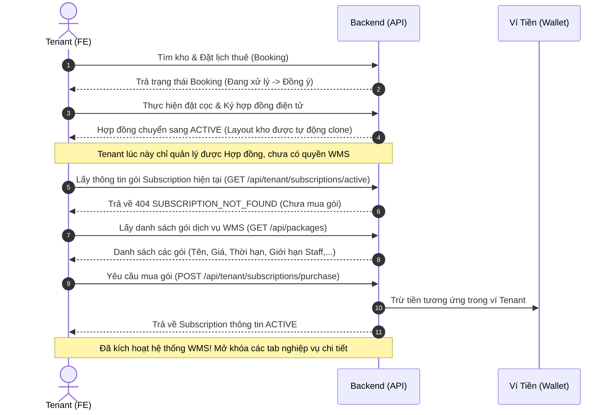

# Hướng Dẫn Tích Hợp FE: Luồng 1 - Mua Gói Dịch Vụ & Phân Quyền WMS

Tài liệu này hướng dẫn cách tích hợp các API liên quan đến mua gói dịch vụ và cơ chế phân quyền quản lý kho bãi (WMS) của hai đối tượng người dùng: **Owner (Chủ kho)** và **Tenant (Người thuê kho)**.

---

## 1. Phân Biệt Hai Loại Gói Dịch Vụ Trong Hệ Thống

Hệ thống StockSpace hỗ trợ hai loại phí/gói dịch vụ chính ứng với từng vai trò:

### 1.1. Phí Đăng Bài Kho Bãi (Warehouse Posting Fee) — Dành Cho Owner
* **Mục đích:** Khấu trừ số dư ví của Owner cho mỗi lần tạo bài đăng kho mới (phí commission/đăng bài).
* **Cơ chế:**
  - Owner khi gọi API tạo kho mới `POST /api/owner/warehouses`, Backend sẽ tự động đọc ID của gói đăng bài từ cấu hình hệ thống (`warehouse_publish_package_id`) và tự động trừ số tiền tương ứng trong ví của Owner.
  - **Lưu ý cho FE:** Owner không cần bấm chọn "mua gói đăng bài" trên giao diện, Backend tự động thực hiện luồng trừ tiền này khi Owner gửi yêu cầu tạo kho. Nếu số dư ví của Owner không đủ, API tạo kho sẽ trả về lỗi `400 Bad Request` với mã lỗi `WALLET_INSUFFICIENT_BALANCE`.

### 1.2. Gói Thuê Bao Quản Trị Kho (WMS Subscription Package) — Dành Cho Tenant
* **Mục đích:** Cho phép Tenant kích hoạt các tính năng quản lý kho nâng cao (WMS Phase 2) sau khi thuê kho bãi thành công.
* **Quyền lợi mở khóa:** Quản lý sản phẩm (Category, SKU), đơn vị tính (UOM), thiết lập sơ đồ vị trí chi tiết (Zone, Rack, Bin), tạo phiếu Nhập/Xuất kho (Inbound/Outbound), thực hiện Kiểm kê kho (Inventory Audit), và cấp tài khoản cho Nhân viên kho (Staff).

---

## 2. Luồng Nghiệp Vụ Kích Hoạt Hệ Thống WMS (Tenant)

Dưới đây là trình tự các bước từ khi Tenant thuê kho đến khi mở khóa được WMS:



---

## 3. Danh Sách Các Endpoints Liên Quan

### 3.1. Lấy tất cả các gói dịch vụ WMS có sẵn (Public Endpoint)
* **API:** `GET /api/packages`
* **Mô tả:** Trả về danh sách các gói dịch vụ đang hoạt động trong hệ thống để người dùng chọn mua.
* **Response Body (JSON):**
```json
{
  "success": true,
  "message": "Lấy danh sách gói dịch vụ thành công",
  "data": [
    {
      "id": "1a2b3c4d-5e6f-7a8b-9c0d-1e2f3a4b5c6d",
      "name": "WMS Basic",
      "price": 200000.00,
      "durationDays": 30,
      "features": "{\"wms\": true, \"max_staff\": 2, \"max_products\": 100}",
      "isActive": true
    }
  ]
}
```

### 3.2. Mua gói dịch vụ WMS (Yêu cầu Role `TENANT`)
* **API:** `POST /api/tenant/subscriptions/purchase`
* **Mô tả:** Trừ tiền từ ví Tenant để kích hoạt gói dịch vụ.
* **Request Body:**
```json
{
  "packageId": "1a2b3c4d-5e6f-7a8b-9c0d-1e2f3a4b5c6d"
}
```
* **Lỗi có thể trả về:**
  - `WALLET_INSUFFICIENT_BALANCE` (400): Ví Tenant không đủ tiền.
  - `SUBSCRIPTION_ALREADY_ACTIVE` (400): Tenant hiện đã có gói dịch vụ đang còn hiệu lực (không được phép mua đè).

### 3.3. Xem thông tin gói đang hoạt động của tôi (Yêu cầu Role `TENANT`)
* **API:** `GET /api/tenant/subscriptions/active`
* **Mô tả:** Lấy thông tin gói cước đang có hiệu lực của Tenant hiện tại.
* **Response Body (JSON):**
```json
{
  "success": true,
  "message": "Lấy gói dịch vụ đang hoạt động thành công",
  "data": {
    "id": "e98c91a0-ff92-411a-ab5d-c6a85817a022",
    "packageName": "WMS Basic",
    "startDate": "2026-07-13",
    "endDate": "2026-08-12",
    "status": "ACTIVE"
  }
}
```
*(Nếu chưa mua hoặc hết hạn, API trả về lỗi HTTP 404 với errorCode: `SUBSCRIPTION_NOT_FOUND`)*.

---

## 4. Lưu Ý Quan Trọng Cho Frontend Khi Thiết Kế Giao Diện

1. **Kiểm tra quyền truy cập trước (Guard Route):**
   - Trước khi cho phép Tenant truy cập vào các màn hình nâng cao của WMS (như sơ đồ layout, danh sách SKU, phiếu nhập xuất), FE nên gọi API `GET /api/tenant/subscriptions/active`.
   - Nếu nhận về lỗi `SUBSCRIPTION_NOT_FOUND`, hãy chặn truy cập và chuyển hướng (hoặc hiển thị Banner) mời gọi Tenant mua gói dịch vụ đi kèm nút chuyển hướng đến trang chọn gói.

2. **Xử lý mã lỗi `SUBSCRIPTION_REQUIRED`:**
   - Tất cả các API WMS của Tenant (ví dụ: `/api/tenant/products/**`, `/api/tenant/inventory/**`) đều được Backend bảo vệ bằng Annotation kiểm tra thuê bao.
   - Nếu gói của Tenant hết hạn trong lúc đang thao tác, Backend sẽ trả về lỗi HTTP 403 với JSON:
     ```json
     {
       "success": false,
       "message": "Yêu cầu phải đăng ký gói dịch vụ WMS để thực hiện thao tác này",
       "errorCode": "SUBSCRIPTION_REQUIRED"
     }
     ```
   - FE cần bắt lỗi toàn cục (Global Error Interceptor) cho mã lỗi `SUBSCRIPTION_REQUIRED` để hiển thị Modal thông báo hết hạn và hướng dẫn gia hạn.

---

## 5. Quyền Lợi Của Tenant Sau Khi Mua Gói Dịch Vụ WMS

Sau khi Tenant thanh toán và kích hoạt thành công gói dịch vụ WMS (trạng thái `ACTIVE`), hệ thống sẽ "mở khóa" (unlock) toàn bộ các chức năng quản lý kho chuyên sâu (WMS Phase 2). Cụ thể, Tenant có thể thực hiện các thao tác sau:

### 5.1. Quản Trị Nhân Sự (Staff Management)
* **Tạo tài khoản nhân viên kho (Staff):** Tenant được quyền tạo các tài khoản phụ cho nhân viên của mình để họ trực tiếp thực hiện công việc tại kho.
* **Giới hạn số lượng:** Số lượng nhân viên tối đa được tạo sẽ phụ thuộc vào thuộc tính cấu hình (ví dụ: `max_staff`) của gói dịch vụ đã mua.
* **Phân quyền vận hành:** Các tài khoản Staff này khi đăng nhập sẽ chỉ nhìn thấy dữ liệu hàng hóa của riêng Tenant đó (cơ chế Tenancy Isolation) và có thể thực hiện các thao tác kiểm đếm, nhập/xuất thực tế thông qua thiết bị cá nhân (điện thoại/máy tính bảng).

### 5.2. Quản Lý Hàng Hóa & Danh Mục (Inventory Management)
* **Thiết lập danh mục (Category) & Đơn vị tính (UOM):** Phân loại hàng hóa một cách có hệ thống và cấu hình các đơn vị đo lường (Cái, Hộp, Thùng, Pallet, kg, v.v.).
* **Khai báo Mã hàng hóa (SKU):** Quản lý chi tiết hồ sơ từng mã SKU bao gồm: trọng lượng, kích thước, hình ảnh, mã vạch (Barcode/QR code). Giới hạn số lượng SKU được tạo có thể phụ thuộc vào thuộc tính `max_products` của gói cước.

### 5.3. Thiết Kế Sơ Đồ Kho Chi Tiết (Warehouse Layout Configuration)
* Mặc định khi thuê kho (chưa có WMS), Tenant chỉ có quyền sử dụng một không gian sàn trống. Sau khi mua WMS, Tenant có quyền **thiết kế Sơ đồ Layout không gian 3D/2D** cho phần diện tích mình đã thuê.
* Tenant có thể chia nhỏ không gian thành các **Khu vực (Zone)**, lắp đặt **Kệ hàng (Rack)**, và định nghĩa các **Ô chứa (Bin/Location)**. Nhờ đó, việc định vị hàng hóa sẽ chính xác đến từng ô trên kệ.

### 5.4. Vận Hành Nhập / Xuất Kho (Inbound / Outbound Operations)
* **Quản lý phiếu nhập (Inbound Receipt):** Lên kế hoạch nhập hàng từ nhà cung cấp, chỉ định chi tiết số lượng, mã SKU. Khi hàng đến kho, Staff có thể đối chiếu và xác nhận số lượng thực tế nhập vào từng ô Bin.
* **Quản lý phiếu xuất (Outbound Batch):** Lên kế hoạch xuất hàng cho đối tác/khách hàng. Hệ thống WMS sẽ hỗ trợ chỉ ra đích xác vị trí cần lấy hàng (Picking) trong kho dựa trên sơ đồ Layout đã thiết lập.

### 5.5. Kiểm Kê Định Kỳ (Inventory Audit)
* **Tạo yêu cầu kiểm kê:** Tenant có thể tạo các đợt kiểm kê định kỳ (cuối tháng/cuối quý) hoặc đột xuất cho toàn bộ kho hay một khu vực (Zone) cụ thể đang nghi ngờ thất thoát.
* **Thực thi và Báo cáo:** Nhân viên kho (Staff) tiến hành đếm số lượng tồn thực tế. Hệ thống WMS sẽ tự động đối chiếu và so sánh độ chênh lệch giữa "số liệu lưu trữ trên phần mềm" và "số đếm thực tế", từ đó đưa ra báo cáo chênh lệch và hỗ trợ điều chỉnh cân bằng kho.
