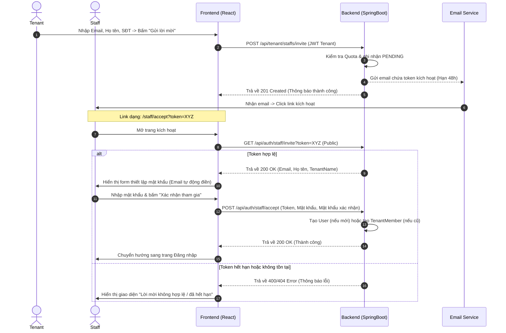

# Hướng Dẫn Tích Hợp FE: Luồng 5 - Mời & Kích Hoạt Tài Khoản Nhân Viên Kho (Staff Invitation)

Tài liệu này hướng dẫn chi tiết cách tích hợp các API liên quan đến quy trình Tenant mời nhân viên kho (Staff) tham gia tổ chức bằng email và Staff kích hoạt tài khoản.

---

## 1. Sơ Đồ Quy Trình Tích Hợp (Invitation Workflow)



---

## 2. Danh Sách API & Cách Tích Hợp

### API 5.1: Tenant Gửi Lời Mời
* **Endpoint:** `POST /api/tenant/staffs/invite`
* **Xác thực:** Header `Authorization: Bearer <JWT_TENANT>`
* **Request Body:**
  ```json
  {
    "email": "nhanvien@gmail.com",
    "fullName": "Nguyễn Văn A",
    "phone": "0987654321"
  }
  ```
* **Response (Thành công - 201 Created):**
  ```json
  {
    "success": true,
    "message": "Gửi lời mời nhân viên kho thành công",
    "data": {
      "email": "nhanvien@gmail.com",
      "fullName": "Nguyễn Văn A",
      "expiresAt": "2026-07-23T14:30:00",
      "message": "Lời mời đã được gửi đến nhanvien@gmail.com. Lời mời có hiệu lực trong 48 giờ."
    }
  }
  ```
* **Mã lỗi thường gặp:**
  - `400 Bad Request` (`STAFF_LIMIT_EXCEEDED`): Vượt quá quota nhân viên tối đa của gói cước hiện tại.
  - `409 Conflict` (`STAFF_INVITATION_DUPLICATE`): Đã có lời mời đang ở trạng thái `PENDING` gửi đến email này.
  - `409 Conflict` (`STAFF_ALREADY_MEMBER`): Email này đã là nhân viên đang hoạt động của Tenant này.

---

### API 5.2: Xem Trước Thông Tin Lời Mời (Validate Token)
Khi Staff nhấn link từ email và được điều hướng đến trang `/staff/accept?token=XYZ`, FE cần ngay lập tức gọi API này để validate token trước khi cho phép điền mật khẩu.

* **Endpoint:** `GET /api/auth/staff/invite?token=XYZ`
* **Xác thực:** Không (Public API)
* **Response (Thành công - 200 OK):**
  ```json
  {
    "success": true,
    "message": "Xác thực token lời mời thành công",
    "data": {
      "email": "nhanvien@gmail.com",
      "fullName": "Nguyễn Văn A",
      "tenantName": "Công ty Kho Vận XYZ",
      "tenantEmail": "tenant@gmail.com",
      "valid": true
    }
  }
  ```
* **Response (Lỗi - 400 Bad Request):**
  ```json
  {
    "success": false,
    "message": "Lời mời đã hết hạn. Vui lòng yêu cầu doanh nghiệp gửi lại lời mời mới.",
    "data": {
      "valid": false,
      "message": "Lời mời đã hết hạn. Vui lòng yêu cầu doanh nghiệp gửi lại lời mời mới."
    }
  }
  ```

---

### API 5.3: Chấp Nhận Lời Mời & Thiết Lập Mật Khẩu
* **Endpoint:** `POST /api/auth/staff/accept`
* **Xác thực:** Không (Public API)
* **Request Body:**
  ```json
  {
    "token": "XYZ",
    "password": "Password123!",
    "confirmPassword": "Password123!"
  }
  ```
  *(Lưu ý: Mật khẩu bắt buộc phải từ 8-100 ký tự, chứa ít nhất 1 chữ hoa, 1 chữ thường và 1 chữ số).*
* **Response (Thành công - 200 OK):**
  ```json
  {
    "success": true,
    "message": "Xác nhận tham gia và thiết lập mật khẩu thành công. Vui lòng đăng nhập lại.",
    "data": null
  }
  ```

---

## 3. Các Điểm Lưu Ý Cho FE Khi Tích Hợp (UX/UI Tips)

1. **Email Tự Động Điền (Read-only):** Khi validate token thành công qua API 5.2, FE hiển thị email của Staff trên UI nhưng hãy để ở trạng thái **disabled/read-only** nhằm tránh việc người dùng sửa email kích hoạt sai mục đích.
2. **Xử lý tài khoản đã tồn tại:** 
   - Nếu Staff sử dụng email đã đăng ký làm Tenant hoặc Staff ở tổ chức khác từ trước, họ **vẫn thiết lập mật khẩu** tại màn hình này để hoàn tất xác nhận liên kết. Mật khẩu của tài khoản gốc sẽ **không bị thay đổi** (họ vẫn dùng mật khẩu cũ để đăng nhập).
3. **Đăng nhập & Trả về `tenantId`:**
   - Khi Staff đăng nhập thành công qua `/api/auth/login`, Response trả về ngoài JWT sẽ có thêm trường `tenantId`.
   - API thông tin tài khoản hiện tại `/api/auth/me` cũng đã được bổ sung thêm trường `tenantId` trong data trả về để FE dễ lưu trữ trong Global State.
