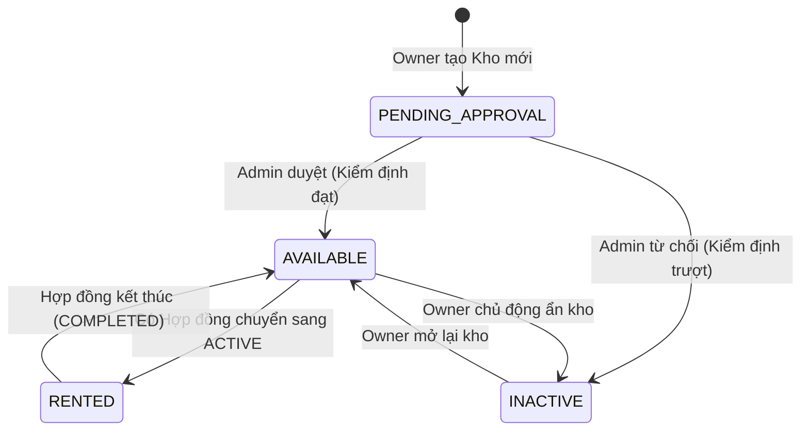
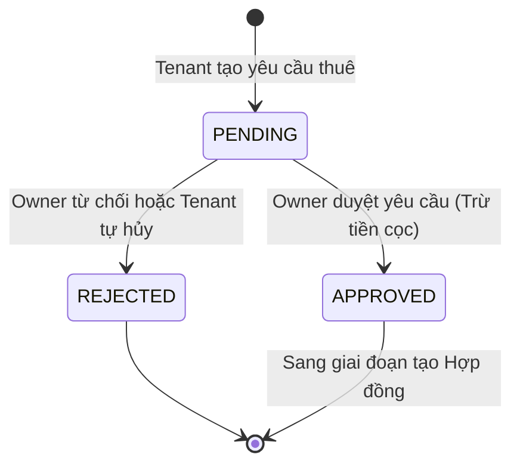
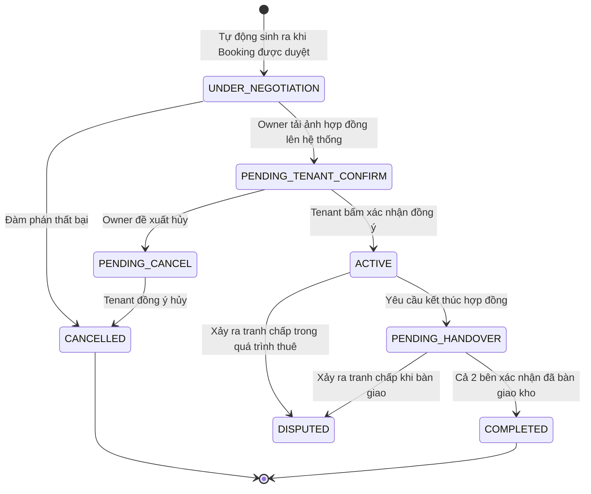
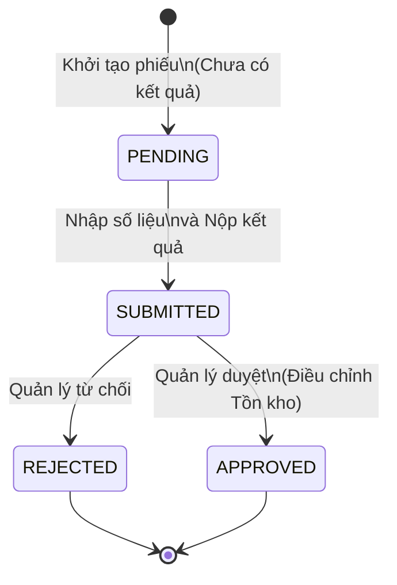
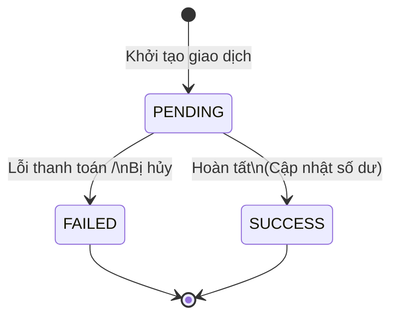
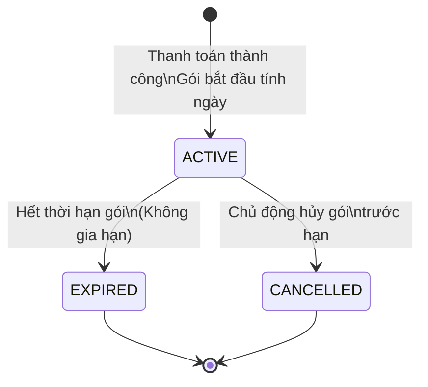

# Tổng hợp State Machine Dự án StockSpace

Tài liệu này tổng hợp các vòng đời trạng thái (State Machine) cốt lõi của các Entity quan trọng trong dự án StockSpace.

## 1. Trạng thái của Kho (Warehouse)
Vòng đời trạng thái của chính Kho hàng (Warehouse), chịu ảnh hưởng bởi quá trình Kiểm định (Inspection) và quá trình Thuê mướn (Contract).
**Enum:** `WarehouseStatus`

---

## 2. Trạng thái Yêu cầu Đặt thuê (Booking Request)
Vòng đời của yêu cầu đặt thuê kho từ Tenant. Luồng này độc lập và diễn ra trước khi Hợp đồng được tạo.
**Enum:** `ApprovalStatus`

---

## 3. Trạng thái Hợp đồng Thuê kho (Rental Contract)
Vòng đời của Hợp đồng thuê. Hợp đồng này được sinh ra tự động ngay khi `BookingRequest` chuyển sang `APPROVED`.
**Enum:** `ContractStatus`

---

## 4. Luồng Kiểm kê Tồn kho WMS (Inventory Audit)
Quản lý vòng đời của một phiếu kiểm kê kho hàng do Thủ kho tạo.
**Enum:** `AuditStatus`

---

## 5. Luồng Giao dịch Ví (Wallet Transaction)
Quản lý trạng thái các giao dịch nạp/rút/thanh toán trên ví điện tử của user.
**Enum:** `TransactionStatus`

---

## 6. Luồng Gói Đăng ký Dịch vụ (Subscription)
Quản lý việc mua gói dịch vụ gia hạn (Sub) của Owner.
**Enum:** `SubscriptionStatus`

